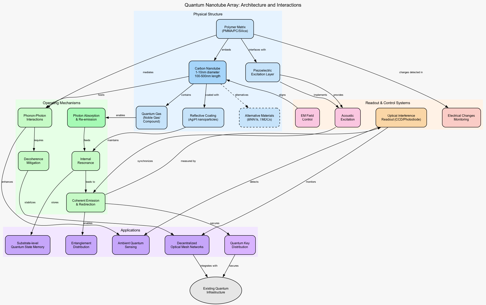

# Quantum Nanotube Lattice Optics
[](https://doi.org/10.5281/zenodo.15085938)

**Repository:** `qnt-lattice-optics`

## Overview
This repository contains the open research and patent-ready design materials for a quantum nanotube-based architecture capable of acting as a **photonic repeater** and **distributed quantum sensor**. It leverages:
- Vertically-aligned carbon nanotube arrays
- Encapsulated noble gases
- Metallic or catalytic coatings (e.g., Pt)
- Diffraction-based ensemble readouts
- Phonon-photon interactions for signal modulation
- Room-temperature quantum operations
- Acoustic isolation via polymer matrix engineering

Our goal is to provide an **open scientific framework** for next-generation quantum communication infrastructure that is:
- Decentralized by design
- Passive and solid-state
- Scalable to large array sizes
- Sensitive to quantum and environmental fields
- Operable at room temperature without cryogenic requirements
- Resilient against common decoherence mechanisms

## Architecture Diagram



*Figure 1: Complete architectural overview showing physical components, operating mechanisms, control systems, and applications of the quantum nanotube array.*

## Project Structure
```
qnt-lattice-optics/
├── qnt-repeater-array.tex # Main LaTeX patent draft (compiles to PDF)
├── qnt-repeater-array.pdf # Generated patent draft (for readers)
├── diagrams/ # DOT/Graphviz + TikZ illustrations
├── fabrication/ # Proposed fabrication methods and parameters
├── validation/ # Experimental validation roadmap
├── integration/ # Integration guidelines for existing quantum systems
├── LICENSE # CERN-OHL-S license for open hardware
├── README.md # This file
```

## 🧠 Current Development Status

✅ Theoretical Foundations
	•	Detailed architecture of reflective quantum nanotube arrays (RQNA) as room-temperature photonic resonators
	•	Bibliographic validation of:
	•	Noble gas encapsulation in CNTs
	•	Platinum and silver-based CNT metallization
	•	CNT-polymer matrix for mechanical stability, acoustic isolation, and optical transparency
	•	Phonon–photon coupling mechanisms
	•	Room-temperature coherence via field-driven and phononic synchronization

✅ Functional Capabilities Outlined
	•	Decoherence mitigation through structural confinement and passive field shielding
	•	Far-field readout and sensing using aggregate optical interference patterns
	•	Pathways for integration into quantum repeaters, passive QKD nodes, and mesh-based quantum networks

✅ Engineering and Scaling Considerations
	•	Nanofabrication feasibility supported by literature and commercial materials (e.g., Pt-CNTs)
	•	Potential for polymer-embedded scalable substrates with high tube density
	•	Compatibility with existing quantum photonic and cryo-agnostic infrastructure

🔜 Next Milestones
	•	Experimental bench validation of emission behavior and phonon-photon coherence
	•	Prototype fabrication: first-generation planar RQNA layer with passive optical output
## Alternative Materials
Beyond carbon nanotubes, we've identified several promising alternative materials:
- Boron nitride nanotubes (BNNTs) for enhanced thermal stability
- Transition metal dichalcogenide (TMDC) nanotubes for specialized electronic properties
- Various quantum gas compositions for frequency-specific applications

## Patent Information
This work is being developed as an open patent under CERN-OHL-S. The comprehensive patent draft includes:
- Detailed technical specifications
- Claims covering both quantum repeater and sensor applications
- Methods for fabrication and integration
- Novel coherence preservation techniques
- Room-temperature operation mechanisms
- Decentralized network implementations

## License
**CERN Open Hardware License v2 - Strongly Reciprocal (CERN-OHL-S)**

This ensures all modified versions of the hardware remain free and open. Attribution to the authors (Paraxiom, Sylvain Cormier) must be retained.

## How to Cite or Reference
If you're collaborating or citing this work, please refer to:

> Paraxiom Team. *Quantum Nanotube Array as Photonic Repeater and Sensor: A Novel Architecture for Quantum Communication and Sensing*. 2025. `qnt-lattice-optics`

## Contact
This repository is maintained by **Paraxiom**.
Lead author: Sylvain Cormier ([@Silvereau](https://github.com/Silvereau))
Website: [https://paraxiom.org](https://paraxiom.org)

---
> "The lattice sees not the particle, but the wave, yet through phonons, we control both."
